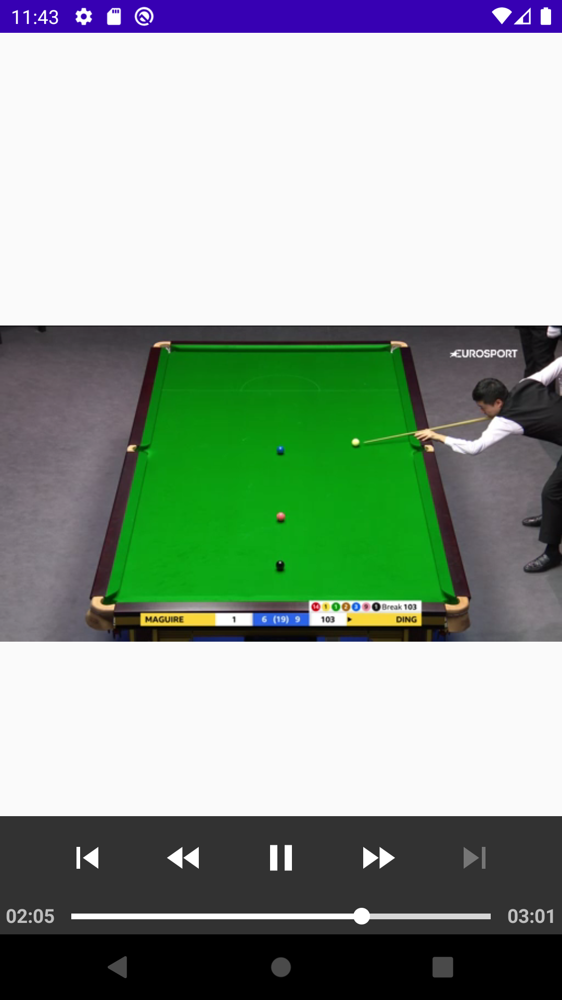
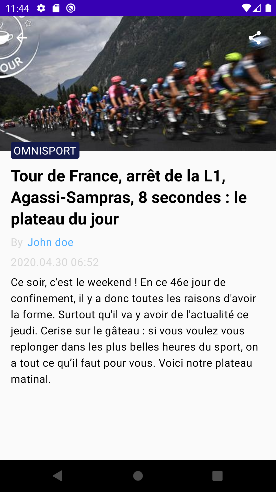

Minimedia is a minimal sample media app 

# Tech

- Kotlin
- Kotlin multiplatform library
- MVVM Architecture 
- Jetpack Compose
- Jetpack Compose navigation
- ExoPlayer
- Junit
- Ktor
- SQLDelight
- Coil

# Tests

## Jetpack Compose tests

[HomeScreenTest](androidApp/src/androidTest/kotlin/HomeScreenTest.kt)
[StoryDetailScreenTest](androidApp/src/androidTest/kotlin/StoryDetailScreenTest.kt)
[StoryItemTest](androidApp/src/androidTest/kotlin/StoryItemTest.kt)
[VideoItemTest](androidApp/src/androidTest/kotlin/VideoItemTest.kt)

## Unit tests

[GetMediasTest](shared/src/commonTest/kotlin/com/lduboscq/minimedia/GetMediasTest.kt)
[MediaRepositoryTest](shared/src/commonTest/kotlin/com/lduboscq/minimedia/MediaRepositoryTest.kt)
